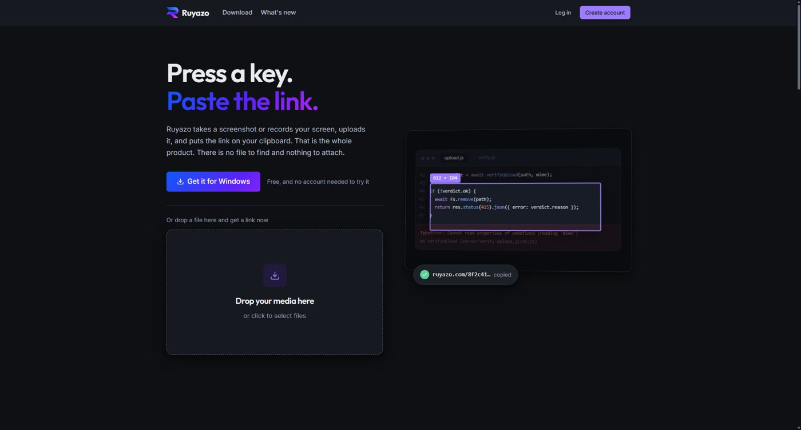
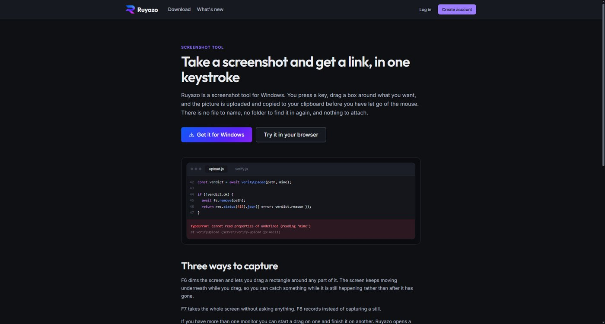
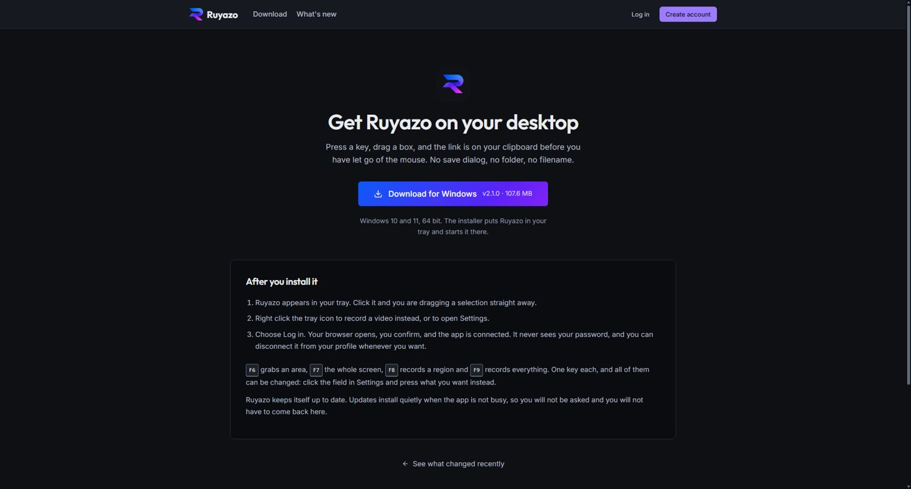
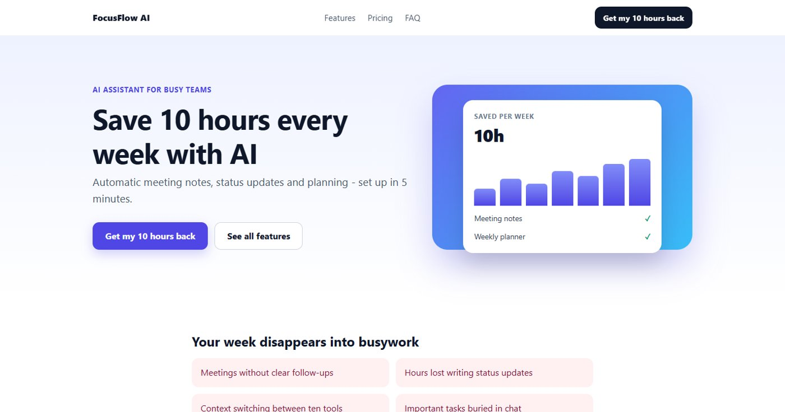
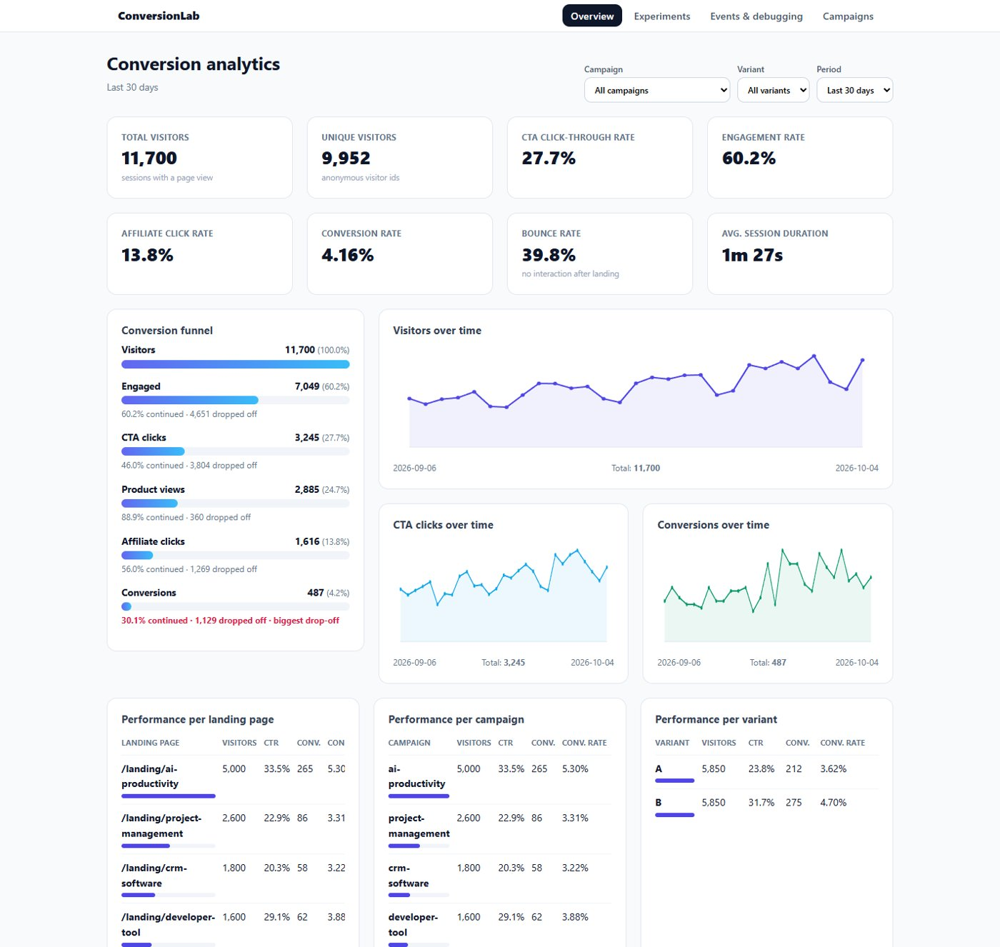
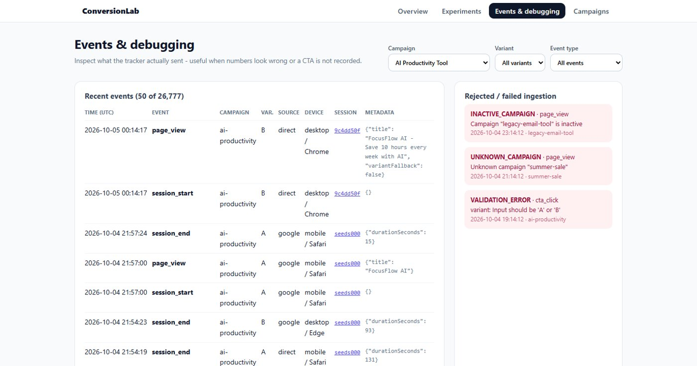
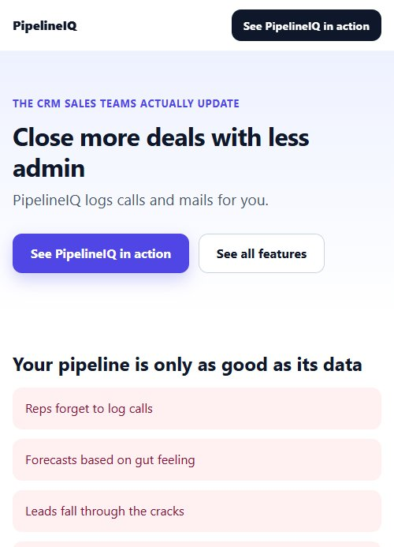
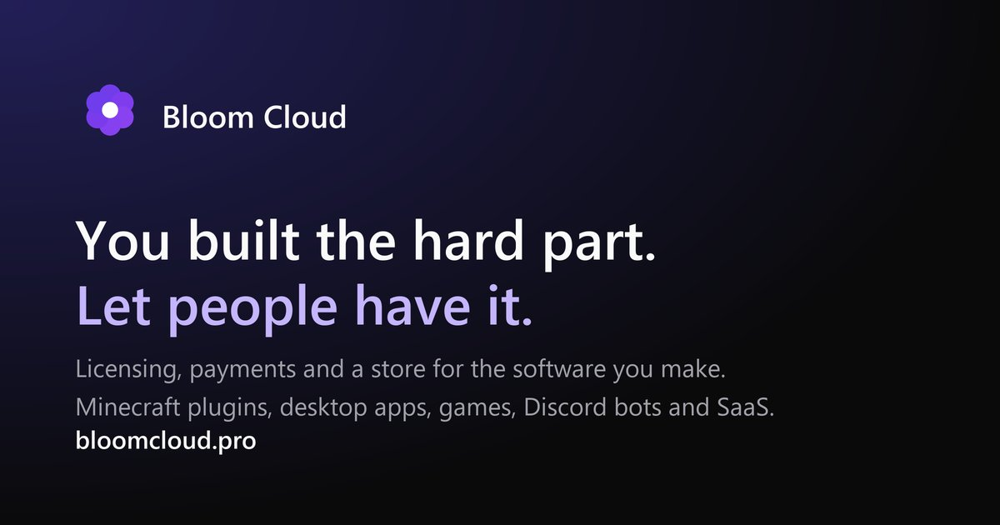
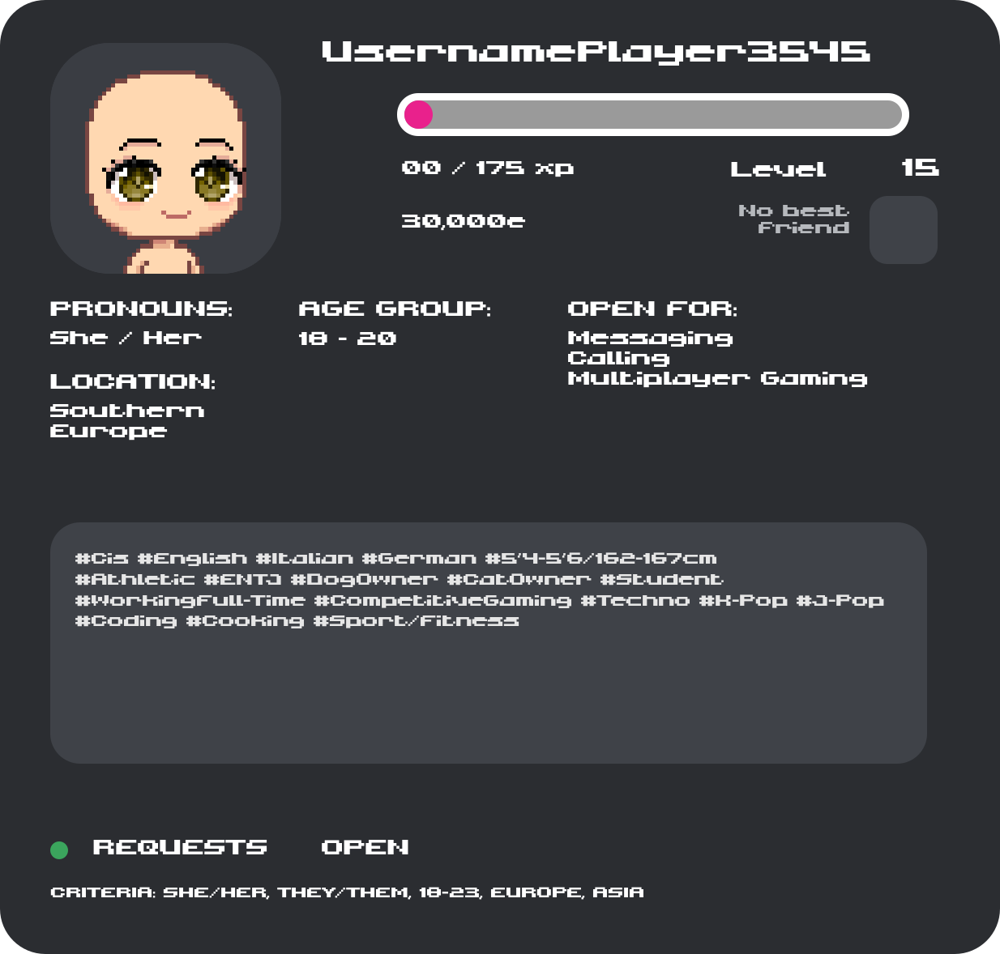

# Portfolio — Djorr

An overview of my finished projects: Minecraft servers and plugins, websites and SaaS platforms, Discord bots and a few standalone tools. Each project describes what it is, how it works and what it looks like. The source code itself is not part of this repository.

**Contents**

- [Minecraft](#minecraft)
  - [CrashVille](#crashville) · [MatrixPearls](#matrixpearls) · [YT-Builds](#yt-builds--cinematic-build-pipeline) · [Linguify](#linguify) · [MT-Grinding](#mt-grinding) · [Billify](#billify) · [Dynamic Shop System](#dynamic-shop-system) · [Smaller plugins](#smaller-plugins)
- [Websites & SaaS](#websites--saas)
  - [Ruyazo](#ruyazo) · [ConversionLab](#conversionlab) · [Bloom Cloud](#bloom-cloud) · [TabPilot](#tabpilot) · [AceBot Live Casino](#acebot-live-casino)
- [Discord bots](#discord-bots)
  - [DMuri](#dmuri) · [Bloom Cloud bot](#bloom-cloud-bot) · [NexusBot](#nexusbot)
- [Other](#other)
  - [DroneWatch](#dronewatch) · [XAUUSD MetaTrader 5 bot](#xauusd-metatrader-5-bot)

---

## Minecraft

### CrashVille

A complete Dutch roleplay server, built as one large Paper plugin with its own resource pack, 3D models and a map of Amsterdam and the Bijlmer.

**What's inside**

- **Economy and banking** — ATMs, card terminals and bank cards with a custom banking interface (insert card, PIN, balance, withdraw, deposit, statement).
- **Jobs** — mining, fishing, mail delivery, farming, lumberjacking and garbage collection, each with its own machines (sawmill, drying kiln, crusher, sorting belt, fish auction).
- **Phone** — personal number, carrier subscriptions, cell towers, apps, an App Store, an ATM app and emergency calls.
- **Emergency services and government** — police (handcuffs, frisking, fines, cells, police database), ambulance, fire department, enforcement officers and a municipality with citizen numbers, ID cards, passports and permits.
- **In-world computers** — separate tower, monitor, keyboard, mouse and printer, running an operating system where you log in as an employee, alderman or mayor.
- **Businesses and shops** — chamber of commerce, wholesale, staff, shelves with packaged products, checkouts and security gates with alarms.
- **Security cameras** — live view, playback, deleting footage and saving it to a USB stick.
- **Casino** — blackjack, slot machines and a Crazy Time wheel with a full 3D studio.
- **Plots and vehicles** — buy or rent per day or week, and vehicles with mileage, dirt, wear and a trunk with weight limits.

**Buildings and world**

| Amsterdam | Bijlmer |
| --- | --- |
|  |  |

**Casino, emergency services and vehicles**

**Interfaces**

| Phone | Police computer |
| --- | --- |
|  |  |

| Bank | Items |
| --- | --- |
|  |  |

**Built with:** Java (Paper), Gradle, custom resource pack with custom models and GUI textures.

---

### MatrixPearls

An Ender Pearl reliability system (Minecraft 1.7 – 1.20.4) with its own web panel. On many servers pearls break at corners, trapdoors and glass, and nobody can tell afterwards why. MatrixPearls fixes that and records every throw.

- **Plugin** — a shared core plus separate compatibility modules per Minecraft version, so behaviour is identical everywhere.
- **Web panel** — every throw is stored as a **replayable 3D scene**: the trajectory, the block where the pearl landed and what the plugin decided (allowed, corrected or blocked) and why.
- **Licences and accounts** — server owners link their server, manage licences and submit bug reports.

| Labelled impact | Live players |
| --- | --- |
|  |  |

| Building the world | Result |
| --- | --- |
|  |  |

**Built with:** Java (multi-version modules), Nuxt, Three.js, Docker.

---

### YT-Builds — cinematic build pipeline

A fully automated pipeline that designs a Minecraft build, has it built and turns it into a cinematic timelapse — no manual work involved.

1. A build plan is generated (current project: *The Forgotten Light*, an abandoned lighthouse on a rocky island).
2. An NPC wearing my skin builds it block by block on a Paper server.
3. An automatically launched Minecraft client acts as the camera, finds open ocean by itself and records.
4. The footage is edited into a timelapse.

| During the build | Final result |
| --- | --- |
|  |  |

**Built with:** Java (Paper plugin), an automated client, Python/ffmpeg for editing.

---

### Linguify

Translates a server's chat for every player individually. Works out of the box with free translation services, no API key required.

- **Player chat** — a Spanish player sees Dutch chat in Spanish; the sender keeps the original, and hovering reveals what was actually said.
- **Join and quit messages** in everyone's own language.
- **Server and plugin messages** (Essentials, WorldEdit, …) are rewritten per player at packet level, without touching server state.

**Built with:** Java (Spigot/Paper), packet interception.

---

### MT-Grinding

Four complete grinding jobs for Minetopia servers:

| Job | What it does |
| --- | --- |
| **Fishing** | Minigame with a moving marker, green zone and increasing loot rarity |
| **Mining** | Ores per pickaxe tier, regenerating blocks and an NPC for buying and selling |
| **Mail delivery** | Pick up parcels at the post office and deliver them to the door the particles point to |
| **Farming** | Sickle, grind wheat into flour at the mill and sell it at the trader |

All tools wear down, Unbreaking included, and the amount is configurable per ore or crop.

---

### Billify

A FiveM-style invoice system for roleplay and economy servers (1.14 – 1.20). Players send each other invoices, manage open and paid invoices in a GUI and open the menu via a command, item or block. Commands, permissions and menus are fully configurable.

---

### Dynamic Shop System

A shop system for 1.21.5 with a realistic economy: admin shops with fixed prices, player shops with their own stock and prices, categories, and **prices that move with supply and demand**. Everything through an extensive GUI and stored in a database.

---

### Smaller plugins

| Plugin | What it does |
| --- | --- |
| **MTW-AntiDupe** | Detects and logs dupes via chests, hoppers, pistons, redstone, explosions, creative and commands (1.12.2) |
| **MTW-Dienst** | `/indienst` and `/uitdienst`: your inventory is saved, you get your duty kit and everything back afterwards |
| **MTW-Reports** | `/report <message>` to online staff, with cooldown and logging to a Discord webhook |
| **MinetopiaSDB BalTop** | Asynchronous balance top of wallet (Vault) plus savings accounts (MinetopiaSDB), paginated, 1.12 – 1.21 |
| **MinetopiaSDB BuildMode** | Safe build mode without external dependencies, works on 1.12 through 1.18+ |
| **VloedjeSMP-Addon** | `/live` for streamers (tab list tag, broadcast, glow) and `/portal` for Overworld ↔ Nether coordinates |

---

## Websites & SaaS

### Ruyazo

A screenshot and screen recording tool for Windows, similar to Gyazo. Press a key, drag a box and the link is on your clipboard. Includes a web platform with accounts where uploads are hosted.

| Screenshot tool | Download |
| --- | --- |
|  |  |

**Built with:** React, Node.js, a Windows desktop client, Docker.

---

### ConversionLab

A SaaS landing page with its own conversion analytics and A/B tests, plus a complete test automation framework (API and browser tests) that runs in CI on every push.

| Dashboard | Event debugging |
| --- | --- |
|  |  |

**Built with:** Python, pytest, Playwright, Postman, GitHub Actions.

---

### Bloom Cloud

A licensing platform for software developers: issuing and validating licences, workspaces, plans with limits and an audit log. Rebuilt with its own backend and PostgreSQL database, with a Discord bot that uses the same services.

**Built with:** Nuxt, Nuxt UI, PostgreSQL, Docker.

---

### TabPilot

An AI browser assistant: select a few open Chrome tabs, describe what you want in a normal sentence, and TabPilot reads those pages and returns one structured answer — a comparison table, a summary or a recommendation with sources. Consists of a Chrome extension, a marketing site and a SaaS backend with subscriptions.

**Built with:** Next.js 15, Tailwind, Supabase, Stripe, Chrome Extension API.

---

### AceBot Live Casino

Three casino tables in the browser with an animated 3D dealer: **Blackjack VIP** (with Perfect Pairs, 21+3 and Bust It), **European roulette** and the **Crazy Wheel** money wheel. Play money only, no server required.

**Built with:** HTML, JavaScript, Three.js.

---

## Discord bots

### DMuri

A Discord bot that feels like a person rather than a command menu — no AI backend, everything scripted. She reads first, types for as long as her reply would really take, and has a mood per server that drifts on its own (lower at night, higher in the evening, and depending on how people treat her). Also includes profile cards, levels, friendships, a verification system and a persona system with its own character creator.

| Profile card | Level card |
| --- | --- |
|  |  |

| Persona creator | Mood |
| --- | --- |
|  |  |

**Built with:** Node.js, discord.js, canvas rendering.

---

### Bloom Cloud bot

Bloom Cloud inside Discord. The bot has no database and no rules of its own: every command goes through the same services as the dashboard, with the same limits and audit log. Permissions are based on the Bloom account of whoever typed the command, not on the bot.

**Built with:** TypeScript, discord.js, Docker.

---

### NexusBot

An all-in-one Discord bot with more than 40 features: games (counting, word snake, Akinator, coin drops), moderation, status roles, staff management, channel management and more.

**Built with:** Python, discord.py.

---

## Other

### DroneWatch

An Android app that passively receives Remote ID signals (ASTM F3411 / OpenDroneID) from drones over Bluetooth and shows them on a map, radar and live list. Includes configurable geofence alerts, distance rings from 250 m to 2 km and a local history. The app only receives; it never controls or interferes with anything.

**Built with:** Kotlin, Android, Bluetooth Low Energy, OpenStreetMap (osmdroid).

---

### XAUUSD MetaTrader 5 bot

A trading bot that trades gold on a **demo account** using a trend-pullback strategy, ATR-based stop loss and take profit, a trailing stop and a daily loss limit. The bot refuses to start on a live account. Includes a web dashboard and TradingView integration.

**Built with:** Python, MetaTrader 5 API.
