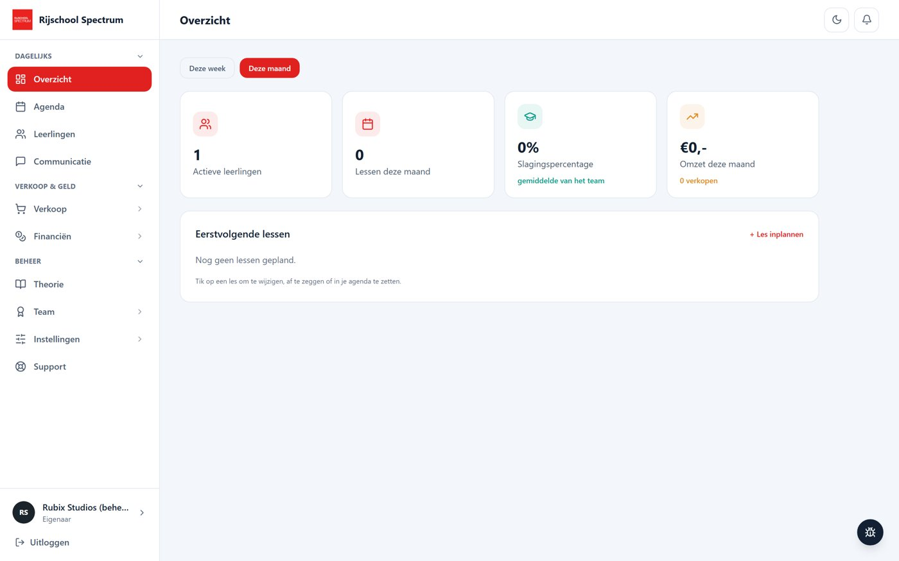
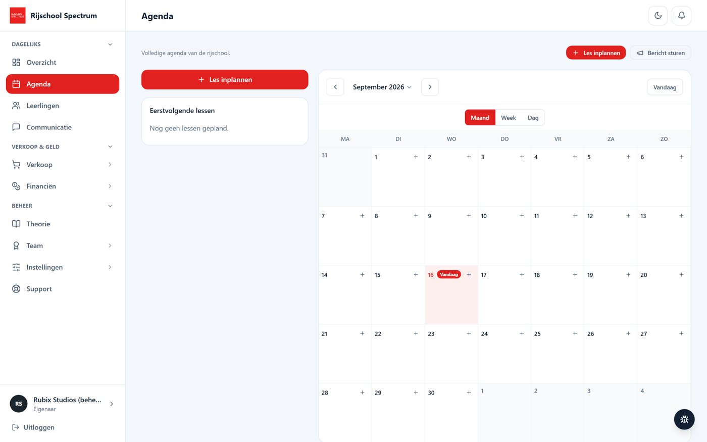
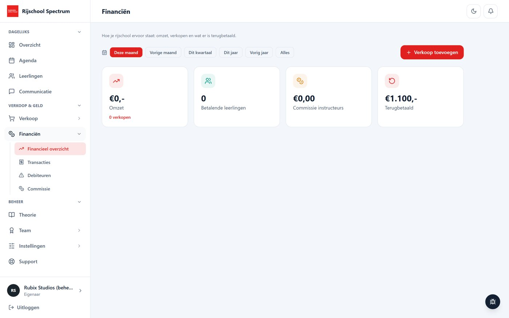
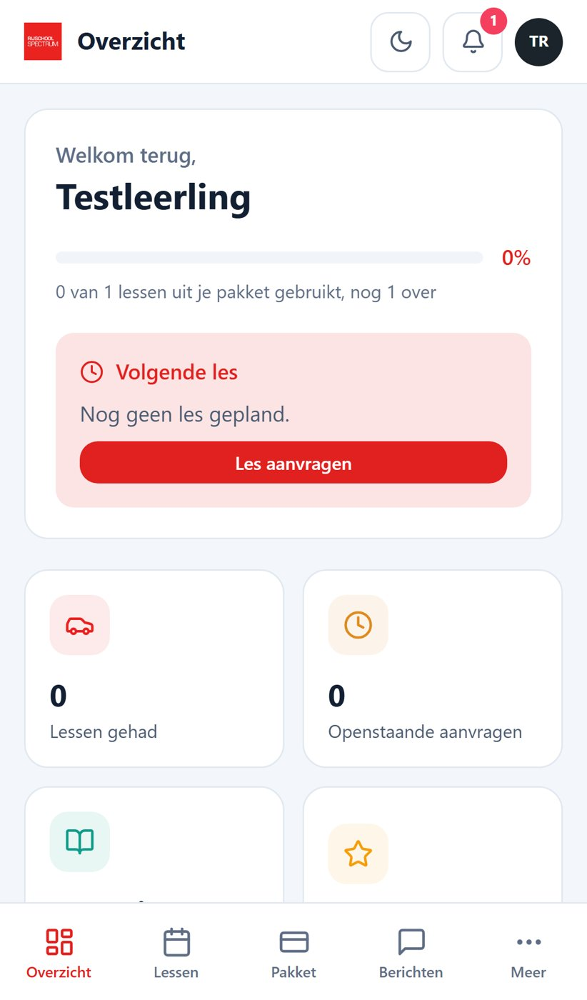
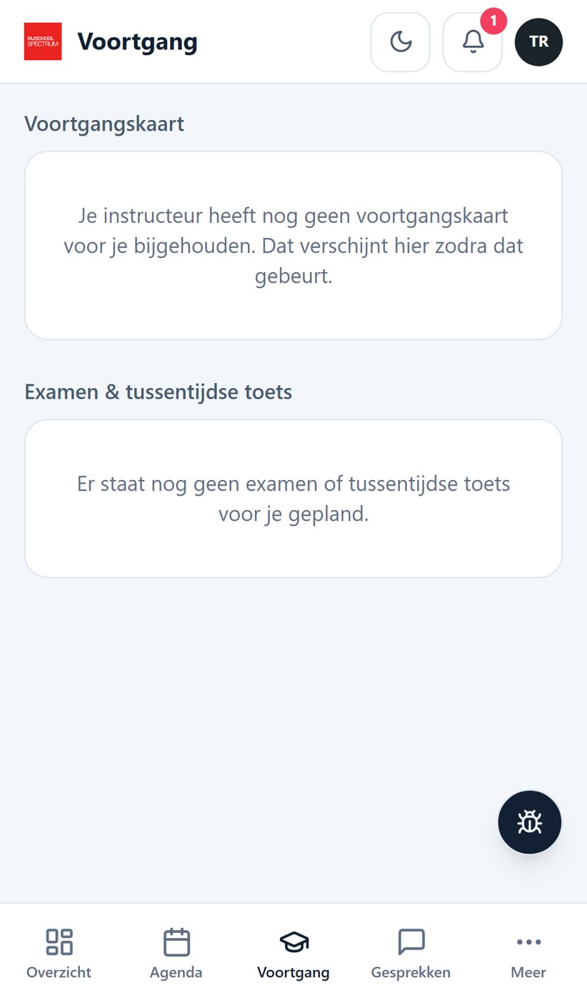
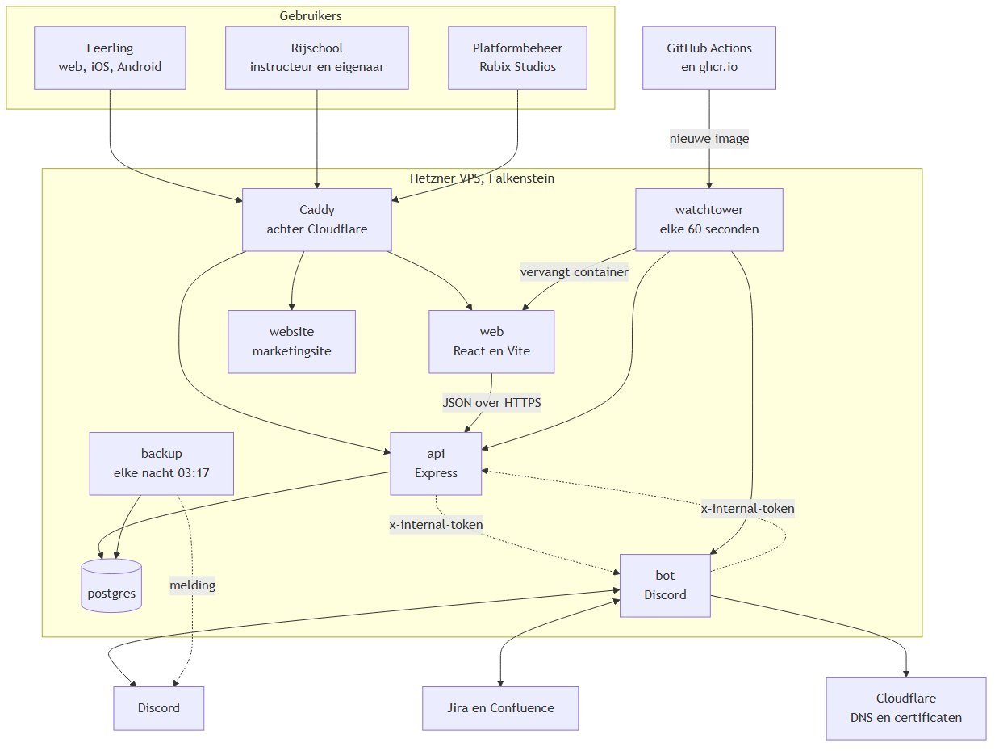
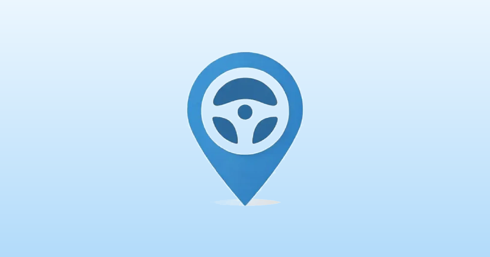

# Portfolio — Djorr

Een overzicht van mijn afgeronde projecten: Minecraft-servers en plugins, websites en SaaS-platformen, Discord-bots en een paar losse tools. Per project staat wat het is, hoe het werkt en hoe het eruitziet. De broncode zelf staat niet in deze repository.

**Inhoud**

- [Minecraft](#minecraft)
  - [CrashVille](#crashville) · [MatrixPearls](#matrixpearls) · [YT-Builds](#yt-builds--cinematic-build-pipeline) · [Linguify](#linguify) · [MT-Grinding](#mt-grinding) · [Billify](#billify) · [Dynamic Shop System](#dynamic-shop-system) · [Kleinere plugins](#kleinere-plugins)
- [Websites & SaaS](#websites--saas)
  - [Drivin2Solutions](#drivin2solutions) · [Ruyazo](#ruyazo) · [ConversionLab](#conversionlab) · [Bloom Cloud](#bloom-cloud) · [TabPilot](#tabpilot) · [AceBot Live Casino](#acebot-live-casino) · [Nami Sushi](#nami-sushi)
- [Discord-bots](#discord-bots)
  - [DMuri](#dmuri) · [Bloom Cloud bot](#bloom-cloud-bot) · [d2s-bot](#d2s-bot) · [NexusBot](#nexusbot)
- [Overig](#overig)
  - [DroneWatch](#dronewatch) · [XAUUSD MetaTrader 5-bot](#xauusd-metatrader-5-bot)

---

## Minecraft

### CrashVille

Een volledige Nederlandse roleplay-server, gebouwd als één grote Paper-plugin met eigen resourcepack, 3D-modellen en een kaart van Amsterdam en de Bijlmer.

**Wat er in zit**

- **Economie en bank** — pinautomaten, pinconsoles en pinpassen met een eigen bankinterface (pas insteken, pincode, saldo, opnemen, storten, afschrift).
- **Banen** — minen, vissen, postbode, farmen, houthakken en vuilnisman, elk met eigen machines (zaagmolen, droogoven, breker, sorteerband, visafslag).
- **Telefoon** — eigen nummer, abonnementen per provider, zendmasten, apps, een App Store, Geldmaat en 112.
- **Hulpdiensten en overheid** — politie (handboeien, fouilleren, boetes, cellen, PolitieNet), ambulance, brandweer, BOA en een gemeente met BSN, ID-kaart, paspoort en vergunningen.
- **Computers in de wereld** — losse pc-kast, monitor, toetsenbord, muis en printer, met een besturingssysteem waarop je inlogt als medewerker, wethouder of burgemeester.
- **Bedrijven en winkels** — KvK, groothandel, personeel, schappen met verpakte producten, kassa's en beveiligingspoortjes met alarm.
- **Bewakingscamera's** — live meekijken, terugkijken, wissen en beelden op een USB-stick zetten.
- **Casino** — blackjack, gokkasten en een Crazy Time-wiel met complete 3D-studio.
- **Plots en voertuigen** — kopen of huren per dag of week, en voertuigen met kilometerstand, vuil, slijtage en een kofferbak met gewicht.

**Gebouwen en wereld**

| Amsterdam | Bijlmer |
| --- | --- |
|  |  |

**Casino, hulpdiensten en voertuigen**

**Interfaces**

| Telefoon | Politiecomputer |
| --- | --- |
|  |  |

| Bank | Items |
| --- | --- |
|  |  |

**Gebouwd met:** Java (Paper), Gradle, eigen resourcepack met custom modellen en GUI-textures.

---

### MatrixPearls

Een betrouwbaarheidssysteem voor Ender Pearls (Minecraft 1.7 – 1.20.4) met een eigen webpaneel. Pearls gaan op veel servers mis bij hoeken, trapdeuren en glas, en niemand kan achteraf zien waarom. MatrixPearls lost dat op en legt elke worp vast.

- **Plugin** — een gedeelde core plus losse compatibiliteitsmodules per Minecraft-versie, zodat het gedrag overal gelijk is.
- **Webpaneel** — elke worp wordt opgeslagen als een **afspeelbare 3D-scène**: de baan, het blok waar de pearl landde en wat de plugin besloot (toegestaan, gecorrigeerd of geblokkeerd) en waarom.
- **Licenties en accounts** — servereigenaren koppelen hun server, beheren licenties en dienen bugreports in.

| Inslag met label | Live spelers |
| --- | --- |
|  |  |

| Wereld opbouwen | Resultaat |
| --- | --- |
|  |  |

**Gebouwd met:** Java (multi-version modules), Nuxt, Three.js, Docker.

---

### YT-Builds — cinematic build pipeline

Een volledig automatische pipeline die een Minecraft-bouwwerk ontwerpt, laat bouwen en er een cinematic timelapse van maakt — zonder handwerk.

1. Er wordt een bouwplan gegenereerd (huidige opdracht: *The Forgotten Light*, een verlaten vuurtoren op een rotseiland).
2. Een NPC met mijn skin bouwt het blok voor blok op een Paper-server.
3. Een automatisch gestarte Minecraft-client dient als camera, zoekt zelf open oceaan en neemt op.
4. De opnames worden gemonteerd tot een timelapse.

| Tijdens het bouwen | Eindresultaat |
| --- | --- |
|  |  |

**Gebouwd met:** Java (Paper-plugin), een geautomatiseerde client, Python/ffmpeg voor de montage.

---

### Linguify

Vertaalt de chat van een server voor elke speler afzonderlijk, werkt direct met gratis vertaaldiensten en heeft geen API-key nodig.

- **Spelerchat** — een Spaanse speler ziet Nederlandse chat in het Spaans; wie het stuurde houdt het origineel, en met hover zie je wat er echt gezegd is.
- **Join- en quitberichten** in ieders eigen taal.
- **Server- en pluginberichten** (Essentials, WorldEdit, …) worden per speler op packet-niveau herschreven, zonder de serverstatus aan te raken.

**Gebouwd met:** Java (Spigot/Paper), packet-interceptie.

---

### MT-Grinding

Vier complete grinding-banen voor Minetopia-servers:

| Baan | Wat het doet |
| --- | --- |
| **Vissen** | Minigame met een bewegende markering, groene zone en oplopende zeldzaamheid van de buit |
| **Minen** | Ores per pickaxe-tier, blokken die terugkomen en een NPC om te kopen en verkopen |
| **PostNL** | Pakketten ophalen bij de postbode en bezorgen bij de deur die de particles aanwijzen |
| **Farmen** | Sikkel, tarwe malen tot meel bij de molen en verkopen bij de inkoop |

Alle gereedschappen slijten, inclusief Unbreaking, en hoeveel stel je per ore of gewas in.

---

### Billify

Een factuursysteem in de stijl van FiveM, voor roleplay- en economieservers (1.14 – 1.20). Spelers sturen elkaar facturen, beheren open en betaalde facturen in een GUI en openen het menu via een commando, item of blok. Commando's, permissies en menu's zijn volledig instelbaar.

---

### Dynamic Shop System

Een shopsysteem voor 1.21.5 met een realistische economie: adminshops met vaste prijzen, spelershops met eigen voorraad en prijzen, categorieën, en **prijzen die meebewegen met vraag en aanbod**. Alles via een uitgebreide GUI en opgeslagen in een database.

---

### Kleinere plugins

| Plugin | Wat het doet |
| --- | --- |
| **MTW-AntiDupe** | Detecteert en logt dupes via kisten, hoppers, pistons, redstone, explosies, creative en commando's (1.12.2) |
| **MTW-Dienst** | `/indienst` en `/uitdienst`: inventory wordt bewaard, je krijgt de kit van je dienst en na afloop alles terug |
| **MTW-Reports** | `/report <bericht>` naar online staff, met cooldown en logging naar een Discord-webhook |
| **MinetopiaSDB BalTop** | Asynchrone baltop van saldo (Vault) plus spaarrekeningen (MinetopiaSDB), met paginering, 1.12 – 1.21 |
| **MinetopiaSDB BuildMode** | Veilige buildmode zonder externe dependencies, werkt op 1.12 tot 1.18+ |
| **VloedjeSMP-Addon** | `/live` voor streamers (tag in tablijst, broadcast, glow) en `/portal` voor Overworld ↔ Nether-coördinaten |

---

## Websites & SaaS

### Drivin2Solutions

Een mobile-first platform voor rijscholen. Rijscholen beheren hun leerlingen, instructeurs, agenda, communicatie en betalingen; leerlingen volgen hun lessen, voortgang en theorie en rekenen af. Elke rijschool krijgt een eigen omgeving met eigen logo, kleur en link. Het platform draait als website én als installeerbare app (PWA + Android).

**Rijschool (desktop)**

| Agenda | Financiën |
| --- | --- |
|  |  |

**Leerling (mobiel)**

| Overzicht | Voortgang |
| --- | --- |
|  |  |

**Architectuur**

Daarnaast heb ik de marketingwebsite gebouwd en een Discord-bot die de livechat koppelt aan support (zie [d2s-bot](#d2s-bot)).

**Gebouwd met:** React, Vite, Capacitor (Android), Docker, Caddy/nginx.

---

### Ruyazo

Een screenshot- en schermopnametool voor Windows, vergelijkbaar met Gyazo. Druk op een toets, sleep een kader en de link staat op je klembord. Inclusief webplatform met accounts waar uploads worden gehost.

| Screenshot-tool | Download |
| --- | --- |
|  |  |

**Gebouwd met:** React, Node.js, een Windows-desktopclient, Docker.

---

### ConversionLab

Een SaaS-landingspagina met eigen conversie-analytics en A/B-tests, plus een volledig test-automatiseringsframework (API- en browsertests) dat bij elke push in CI draait.

| Dashboard | Events debuggen |
| --- | --- |
|  |  |

**Gebouwd met:** Python, pytest, Playwright, Postman, GitHub Actions.

---

### Bloom Cloud

Een licentieplatform voor softwareontwikkelaars: licenties uitgeven en valideren, workspaces, plannen met limieten en een auditlog. Herbouwd met een eigen backend en Postgres-database, met een Discord-bot die dezelfde services gebruikt.

**Gebouwd met:** Nuxt, Nuxt UI, PostgreSQL, Docker.

---

### TabPilot

Een AI-browserassistent: selecteer een paar open Chrome-tabbladen, beschrijf in een gewone zin wat je wilt, en TabPilot leest die pagina's en geeft één gestructureerd antwoord — een vergelijkingstabel, samenvatting of advies met bronnen. Bestaat uit een Chrome-extensie, een marketingsite en een SaaS-backend met abonnementen.

**Gebouwd met:** Next.js 15, Tailwind, Supabase, Stripe, Chrome Extension API.

---

### AceBot Live Casino

Drie casinotafels in de browser met een geanimeerde 3D-croupier: **Blackjack VIP** (met Perfect Pairs, 21+3 en Bust It), **Europese roulette** en het **Crazy Wheel**-geldwiel. Alleen speelgeld, geen server nodig.

**Gebouwd met:** HTML, JavaScript, Three.js.

---

### Nami Sushi

Landingspagina voor een sushirestaurant, met menu, chef en reserveringen.

**Gebouwd met:** Next.js, Tailwind, Vercel.

---

## Discord-bots

### DMuri

Een Discord-bot die aanvoelt als een persoon in plaats van een commandomenu — zonder AI-backend, alles gescript. Ze leest eerst, typt zo lang als haar antwoord echt zou duren en heeft per server een stemming die vanzelf verschuift ('s nachts lager, 's avonds hoger, en afhankelijk van hoe mensen tegen haar doen). Daarnaast profielkaarten, levels, vriendschappen, een verificatiesysteem en een personasysteem met eigen character creator.

| Profielkaart | Levelkaart |
| --- | --- |
|  |  |

| Persona-creator | Stemming |
| --- | --- |
|  |  |

**Gebouwd met:** Node.js, discord.js, canvas-rendering.

---

### Bloom Cloud bot

Bloom Cloud in Discord. De bot heeft geen eigen database en geen eigen regels: elk commando gaat via dezelfde services als het dashboard, met dezelfde limieten en auditlog. Rechten worden bepaald op basis van het Bloom-account van wie het commando typt, niet van de bot.

**Gebouwd met:** TypeScript, discord.js, Docker.

---

### d2s-bot

Koppelt de livechat op de Drivin2Solutions-websites aan Discord. Elk gesprek wordt een eigen thread in een forumkanaal, met de gegevens van de bezoeker en knoppen om over te nemen of te sluiten. Support typt gewoon in de thread en dat komt live bij de bezoeker aan, en andersom.

**Gebouwd met:** Node.js, discord.js, WebSockets, Docker.

---

### NexusBot

Een alles-in-één Discord-bot met meer dan 40 functies: spellen (tellen, woordslang, Akinator, coin drops), moderatie, statusrollen, staffbeheer, kanaalbeheer en meer.

**Gebouwd met:** Python, discord.py.

---

## Overig

### DroneWatch

Een Android-app — "Flitsmeister voor drones" — die passief Remote ID-signalen (ASTM F3411 / OpenDroneID) van drones opvangt via Bluetooth en ze op een kaart, radar en live-lijst toont. Met instelbare waarschuwingen via geofences, afstandsringen van 250 m tot 2 km en een lokale geschiedenis. De app ontvangt alleen; hij bestuurt of stoort niets.

**Gebouwd met:** Kotlin, Android, Bluetooth Low Energy, OpenStreetMap (osmdroid).

---

### XAUUSD MetaTrader 5-bot

Een tradingbot die op een **demo-account** goud handelt met een trend-pullback-strategie, ATR-gebaseerde stop loss en take profit, trailing stop en een dagelijkse verlieslimiet. De bot weigert te starten op een echt account. Inclusief webdashboard en TradingView-koppeling.

**Gebouwd met:** Python, MetaTrader 5 API.
